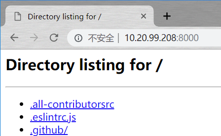

# Python Tips & Tricks (一)

算了算用 Python 也有一段时间了, 写过的代码不多, 踩过的坑倒不少. 知道自己的榆木脑袋靠不住, 便有了这篇小短文. 在毕设中期答辩之后抽空赶工而成, 如有错误欢迎指正!

---
[TOC]

---

## 语法

### 1. 三目运算符

   和其他语言基本一样, 一般用在赋值中, 不滥用的话可以增强可读性

   > "你知道回字的四种写法吗? 你知道三目运算符的三种写法吗?"

```python
b = 2
# (1)
a = 1 if b > 1 else 0 # 正常人版本
a
>>> 1
# (2)
a = b > 1 and 1 or 0 # 使用了短路逻辑,不推荐,因为当涉及布尔值时会出错
a
>>> 1
# (3)
a = (1, 0)[b < 1] # 完全不推荐, 不是元组下标的正确用法
a
>>> 1
# (2.1)
b = False # 短路逻辑出错例子
a = b > 1 and 1 or 0 
a
>>> 0
```

​python 中短路逻辑参见相关讨论  [Python里and、or的计算规则是怎样的?](https://www.zhihu.com/question/20152384)

### 2. 各种生成式: list dict set

   同样, 不滥用的话可以增强可读性

   ```python
   a = list(range(-5,5))

   [x*2 for x in a] 
   >>> [-10, -8, -6, -4, -2, 0, 2, 4, 6, 8]

   [str(x) for x in a] if isinstance(a, list) else [] # 同时进行条件判断
   >>> ['-5', '-4', '-3', '-2', '-1', '0', '1', '2', '3', '4']

   c = {0: 0, 1: 10, 2: 20}
   {k: v for k, v in c.items() if v > 0} # 字典生成式, 保留值大于 0 的
   >>> {1: 10, 2: 20}
   ```

### 3. else with loop

   只有当循环语句完整执行完了, 才会执行 else clause 里的部分, python 的一个黑魔法, 不过比较少用

```python
for x in range(1,10):
    pass
else:
  print("final")
>>> final
```

### 4. list 从后往前遍历

```python
a = range(0,10)
for x in a[: : -1]:
    print(x,end=' ')
>>> 9 8 7 6 5 4 3 2 1 0
```

一般用在通过 index 删除列表中特定元素时使用, 如果顺序遍历的话可能会略过元素

### 5. dict 相关

当字典键是 str 类型的情况下:

```python
# dict constructor
para = dict(
  a=1,
  b=2
)
# dict literal
para = {
  "a" : 1,
  "b" : 2
}
```

`dict constructor` 方便 IDE 的自动补全和纠错, 也更 pythonic, 但代价就是性能会差一点(当然这在毫秒级别上来说并不是多大件事), 具体性能和内部差异的可以参考这个帖子 [Dict() vs {} in Python](https://medium.com/jodylecompte/dict-vs-in-python-whats-the-big-deal-anyway-73e251df8398)

### 6. list 相关

```python
a = list(range(0,10))

a.pop() # 多次调用模拟栈
>>> 9
a.pop(0) # 多次调用模拟队列
>>> 0

# 三种方法实现列表倒转
# (1) built-in function, 有返回值, 返回的是迭代器
list(reversed(a))
>>> [8, 7, 6, 5, 4, 3, 2, 1]

# (2) list method, 改变了原来的列表, 但也因此更快且不需要额外的内存
a.reverse()
a
>> [8, 7, 6, 5, 4, 3, 2, 1]

# (3) 使用切片实现, 易读性不太好而且是浅复制, 但更灵活(如调整步幅)
a[::-1]
>> [1, 2, 3, 4, 5, 6, 7, 8]
```

PS: 特意提出来是因为经常会出现类似 `a = a.reverse()` 之类错误的代码, 扯远点讲这涉及到函数( function)  和方法(method) 之间的概念不清了,可以参考[这里](https://stackoverflow.com/questions/155609/whats-the-difference-between-a-method-and-a-function?rq=1).

另外这种 bug 就如同 SQL 里写 `== Null` 和 Java 里在 `switch case ` 后不加 `break` 一样, 是那种可以 debug 到凌晨两点, 发现问题之后恨不得把头撞到显示器上的低级错误 🙂.

同样的还有列表排序 `list.sort()` 和 `sorted(list)`, 当然因为涉及到排序规则会复杂点, 可以参考[官方文档](https://docs.python.org/3/howto/sorting.html)

### 7. 字符串拼接

   当要频繁地更改字符串里的参数时, 可以考虑用自带的 `Template` 取代 `str` 的拼接, 文档参考[这里](https://docs.python.org/3/library/string.html#template-strings)

   ```python
   from string import Template

   find_info = Template("ps aux | awk ' $2==$pid {print $3}'")
   # 只替换参数字典中存在的键 (pid), 而对于 ($2,$3) 不会报错
   find_info.safe_substitute({"pid": 1223})
   >> "ps aux | awk ' $2==1223 {print $3}'"
   ```

   当然 `f-string` (要求版本 3.6+ )也是一个不错的选择.

   ```python
   timeit.timeit('''from string import Template;find_info = Template("ps aux | awk ' $2==$pid {print $3}'"); find_info.safe_substitute({"pid": 1223}) ''', number=10000)
   >> 0.045924287755042315

   timeit.timeit('''pid=123;f"ps aux | awk ' $2=={pid} {{print $3}}'"''', number=10000)
   >> 0.002117808908224106
   ```

### 8. 偏函数

这个小东西理解起来不困难. 指的是函数里, 有一部分参数是可选的.

```python
def add(a,b= 1): # 参数 a 必须提供; 若有传入 b 则用传入值, 若无则用默认值 1
    return a + b

add(3, 2)
>> 5
add(3)
>> 4
```

当然, 要那么简单就不会拿出来说了, 这里面有个关键的问题是**默认参数必须是不可变对象**, 不然就等着程序出 bug, 内存爆炸吧 😀

```python
def add_list(lis = []):
    lis.append(1)
    print(lis)

add_list()
>> [1]
add_list()
>> [1, 1]
```

## 库

### 1. python 开 HTTP 服务器

只需在命令行中输一行代码即可, 一般用在内网两台 Linux 电脑 或者 Linux 和手机互传文件, 可以说是最方便的工具了

```python
python -m SimpleHTTPServer # Python2 适用
python -m http.server # Python3 适用
```

<div align="center"></div>

PS:

1. 默认端口为 8000, 可进行修改 (在命令后面标明)
2. 如果当前文件下有 `index.html` 网页文件, 默认会进行展示
3. 没有权限控制, 注意安全(文件泄露) 问题

### 2. 匹配

   提一个场景:

   > 对日志文件进行定时扫描
   >
   > 对于一条记录, 满足以下任意一条匹配规则则进行提取
   >
   > - 含有关键词 $$A_1$$, $$A_2$$... $$A_n​$$ 中的任意一个
   > - 含有关键词 $$B_1​$$, $$B_2​$$... $$B_n​$$ 且依次出现
   > - 含有关键词 $$C_1$$, $$C_2$$... $$C_n​$$ 乱序出现
   >
   > 记录中含有的关键词用 {} 标识高亮

   先放自己测试的结论(300M大小): [Google re2](https://github.com/google/re2) > numpy 脚本匹配  > python 自带 re 模块拼接

   按照 re2 官方文档的[测试](https://pypi.org/project/re2/#performance), 简单的正则 re 效率稍高, 但当表达式复杂起来, *When the `re` module gets slow, it gets really slow*.

   用 numpy 做筛选的想法是从知乎这个回答[python的numpy向量化语句为什么会比for快？](https://www.zhihu.com/question/67652386)引申来的, 但比 re 还要快, 真的是出乎意料 (也有可能是因为我正则写得太菜了, 手动狗头🐶).

   另外 re 模块里:

- `re.findall()` 函数有坑, 需要用圆括号括起来匹配的部分, 具体可以参考 v2 的[讨论帖](https://www.v2ex.com/t/481337)和知乎的[专栏](https://zhuanlan.zhihu.com/p/37900841)
- 用 r'your string' 来避免二次转义, 但是注意不能以'\'结尾
- 若输入的字符串中存在正则的符号, 可以用 `re.escape()` 进行转义

### 3. 文件读取

   用 seek 和 tell 能够在文件中快速进行跳转, 就无需先加载到内存中再遍历了

   ```python
   # 输出一个文本最后的 500 个字节
   with open("tidb.log", "r") as fo:
     fo.seek(0, 2) #直接跳到文件尾
     po = fo.tell() # 得到文件字节数(大小)
     po = po - 50000 if po > 50000 else 0
     fo.seek(pointer,0)
     res = fo.readlines()
   ```

​`linecache`

```python
import linecache

a = linecache.getline('a.txt',4) # 只需要一个文件的具体某行
b = linecache.getlines('a.txt')[0:4] # 行数区间

linecache.checkcache('a.txt') # 当硬盘上文件有变动时,更新缓存
c = linecache.getline('a.txt',4)

linecache.clearcache()  # 清除内存里的缓存
```

​对于大文件(GB 级别) 推荐用 for 直接对文件对象进行遍历操作,而不是用 `fo.readlines()`

​操作的是 iter 迭代器, 能够节约很多内存

```python
with open('filename') as fo:
    for line in fo:
        do_things(line)
```

### 4. 自定类

   之前用 Python 更多的是在 AI 课程作业上, 完全没有考虑到面向对象的写法. 在实习时因为要实现一个数据库的本地监控程序, 把 OOP 的一些想法用 Python 实现了.

   看了看去年暑假实习写的代码, 有点不堪入目, 在这里忏悔一下. 希望明年看到这篇文章的自己也有同样的感觉😄.

   ```python
   class AbstractMeta(object): # py3 无所谓, py2 显式标明继承 obejct, 说明是新式类
       def __init__(self):
           pass

       # 定义了 str(AbstractMeta()) 和 print(AbstractMeta()) 的返回
       def __str__(self):
           pass

       # 能被用于 for ... in 循环, 返回迭代器
       def __iter__(self):
           pass

       def __next__(self):
           pass

       # 定义了 len(AbstractMeta()) 的返回
       def __len__(self):
           pass

       # 用于限制实例的属性
       def __slots__(self):

       # 用于支持对下标的访问, 如 AbstractMeta()[0], 注意 slices 的情况
       def __getitem__(self, n):

       @property # 只读属性, 对应属性用下划线进行隐藏
       def birth(self):
           return self._A

       @birth.setter # 用于对 birth 属性进行传入值检查
       def birth(self, value):
           self._birth = value
   ```

   PS:  

- \_\_slots\__ 可以大幅度节省内存, 详情可以看这里 [Python内存优化：Profile，slots，compact dict](https://www.cnblogs.com/xybaby/p/7488216.html)

- \_\_del_\_ 的重写可能会影响 gc , 之前在[python 下好用的注入工具 pyrasite](https://hdamao.com/post/10.html) 提到过

- \_\_init\_\_ 和 \_\_new_\_ 的区别 : 

    提出来是因为鹅厂面试的时候问到了, 但是只用过前者, 回来后查了查:

    - _\_init\_\_ : 在对象创建好之后初始化变量

    - \_\_new_\_: 用于创建对象并返回对象, 如要实现单例模式的话, 就需要重写该方法:

       ```python
       class Singleton(object):
           _instance = None
           def __new__(cls, *args, **kwargs):
               if cls._instance is None:
                   cls._instance = object.__new__(cls, *args, **kwargs)

               return cls._instance
       ```

     顺便吐槽一句鹅厂奇怪的规定: "同一个部门被拒了就不能再发offer了，不同组也不行". 技术两面都过了, 却凉在了这上面. 心心念念的腾讯实习就这么泡汤了, 真是郁闷呐.

### 5. 装饰器

   看到装饰器第一想法是注解(Annotation) , 果然被 `Java` 毒害太深了. 找了找还真有[比较帖](https://zhuanlan.zhihu.com/p/22277764).

   接下来的想法就很自然: 装饰器模式(向一个现有的对象添加新的功能，同时又不改变其结构) 和 AOP (面向切面编程).

   ```python
   # 简单的参数验证装饰器
   def validate_first_para(func):
       def check(para, *args):
           if not para:
               print('illegal input')
           return func(para, *args)

       return check

   @validate_first_para # 会对 id 进行验证, 如果非法直接返回
   def format_id(id):
       return id + 5

   format_id(0)
   >> illegal input

   format_id(3)
   >> 8
   ```

### 6. 拷贝

   相关概念不赘述了, 网上相关文章很多, 直接看例子即可

   ```python
   from copy import copy, deepcopy

   a = [[1,2,3],[4,5,6]] # list 为可变对象
   b = a # 赋值
   c = copy(a) # 浅拷贝
   d = deepcopy(a) # 深拷贝

   a[0][0] = 0 # 更改当前可变对象中的可变对象的元素 
   a[1] = [7,8,9] # 更改当前可变对象中的元素

   a
   >> [[0, 2, 3], [7, 8, 9]]
   b
   >> [[0, 2, 3], [7, 8, 9]]
   c
   >> [[0, 2, 3], [4, 5, 6]]
   d
   >> [[1, 2, 3], [4, 5, 6]]
   ```

   专门提出来的原因是, python 自带的 deepcopy 函数太太太慢了... ... 自定义实现的深拷贝效率比起调函数来快了十倍.

   ```python
   timeit('from copy import deepcopy;a=[[x,x] for x in range(10)];deepcopy(a)', number=10000)
   >> 0.6418874897062778
   timeit('a=[[x,x] for x in range(10)];[[x[0],x[1]] for x in a]',number=10000)
   >> 0.05155083909630775
   ```

   一般情况下内置函数都要比自己实现效率要高, 这个是个特例. 找了一下, [这篇文章](http://www.algorithmdog.com/slow-python-deepcopy)从源码上解释了一下原因: 为了某些特殊情况下的鲁棒性牺牲了性能.

   > 其中 memo 保存着所有拷贝过的对象。
   >
   > 在某些特殊情况下，一个对象的相关对象可以指向它自己，比如双向链表。如果不将拷贝过的对象存着，那程序将陷入死循环。  
   >
   > 深拷贝需要维护一个 memo 用于记录已经拷贝的对象，这是它比较慢的原因。在绝大多数情况下，程序里都不存在相互引用。但作为通用模块，Python 深拷贝必须为了这 1% 情形，牺牲 99% 情形下的性能。

   解决方案是自己实现对应类中的 \_\_deepcopy__ 函数.

顺便吐槽一下:

- Python: 功能实现了, 坑避开了, 效率低 **是 feature 不是 bug** , 不爽不要用.
- C++: 为了解决这个问题, 我们提供了 `DeepcopyForMutualRef` 和 `DeepcopyForNormalRedf` 分别来处理有相互引用和没有相互引用的情况, 同时还提供了 `DeepcopyMaybeMutualRef` 和 `DeepcopyMaynotMutualRef` 来处理可能会有相互引用和可能会没有相互引用的情况.
- Java: 我们提供了一个有 5 个子过程的需要传入 3 个参数的长方法来解决这个问题, 但是因为超过20行了, 不够面向对象, 准备在下一个版本重写为 4 个 interface 和 6 个 class.
- C: 蛤? 想有标准库, 想多了. 不好意思自己实现吧.

## 3. 相关

想了想, 最后放一些相关的网页和文章吧, 感谢这些知识的源泉.

- [CPyUG](https://wiki.woodpecker.org.cn/moin/) *华蟒*用户组, 上世纪的网页风格, 永远停留在 10 年的更新, 时代的眼泪. 放在第一位, 权当怀念了.
- [Unofficial Windows Binaries for Python Extension Packages](https://www.lfd.uci.edu/~gohlke/pythonlibs/) 这个网站提供了绝大多数 Windows 环境下的直装包, 对于各种 pip 报错困难户真的是神器.
- [wtfpython](https://github.com/leisurelicht/wtfpython-cn) **强烈推荐!** 里头全是那些年踩过的坑, 当然更重要的是透过现象看本质. 反人类反直觉的背后藏着的是 Python 的设计思路.
- [interview_python](https://github.com/taizilongxu/interview_python) 顾名思义, 面试前临时抱佛脚用.
- [awesome-python](https://github.com/vinta/awesome-python) 对于一门语言来说, 在 GitHub 上 star 了对应的 awesome 仓库就相当于精通了😀.
- [Go vs. Python](http://govspy.peterbe.com/) 通过比较 Go 和 Python 来学习彼此, 之前因为实习的原因在学 Go, 这篇文章提供了很多例子.
- [PyPy.js](https://pypyjs.org/index.html) 很有意思的一个项目, 在 web 上提供了一个 Python 环境.

## The Zen of Python

Python 之禅

```python
import this
>> The Zen of Python, by Tim Peters

Beautiful is better than ugly.
Explicit is better than implicit.
Simple is better than complex.
Complex is better than complicated.
Flat is better than nested.
Sparse is better than dense.
Readability counts.
Special cases aren't special enough to break the rules.
Although practicality beats purity.
Errors should never pass silently.
Unless explicitly silenced.
In the face of ambiguity, refuse the temptation to guess.
There should be one-- and preferably only one --obvious way to do it.
Although that way may not be obvious at first unless you're Dutch.
Now is better than never.
Although never is often better than *right* now.
If the implementation is hard to explain, it's a bad idea.
If the implementation is easy to explain, it may be a good idea.
Namespaces are one honking great idea -- let's do more of those!
```

