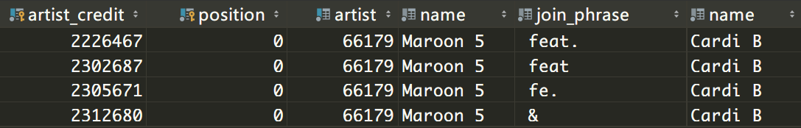

# 基于 Billboard 榜单的个性化查询服务（二）

[TOC]

## 1. 写在前面

上学期期末和寒假花费了不少时间在这个项目上面，眼看着就要开学了，也是时候梳理一下最近完成的内容了。

主要完成了三方面内容：搭建并摸索使用了音乐数据库`MusicBrainz`，重新设计了数据库的模式，思考了个性化查询的实现。

## 2. MusicBrainz

#### 1. 简介

按照之前的思路，需要一个音乐相关的数据源，能够用来标识和清洗爬取的数据。查找后，选定了这么一个平台。按照其[官网](https://musicbrainz.org/)的说法：

> MusicBrainz is an open music encyclopedia that collects music metadata and makes it available to the public.
>
> MusicBrainz aims to be:
>
> 1. **The ultimate source of music information** by allowing anyone to contribute and releasing the [data](https://musicbrainz.org/doc/MusicBrainz_Documentation) under [open licenses](https://musicbrainz.org/doc/About/Data_License).
> 2. **The universal lingua franca for music** by providing a reliable and unambiguous form of [music identification](https://musicbrainz.org/doc/MusicBrainz_Identifier), enabling both people and machines to have meaningful conversations about music.

可见，对于这个项目大部分的需求可以得到满足。同时网站有提供 API ，但还是考虑通过在本地搭建数据库的副本实现，官方有提供详细的[教程](https://github.com/metabrainz/musicbrainz-server/blob/master/INSTALL.md)。搭建完成后，可以导入之前的数据并使用提供的工具保持同步。注意需要预留出 100GB 左右的磁盘空间。

#### 2. 模式

官方教程中的 [schema](https://musicbrainz.org/doc/MusicBrainz_Database/Schema)：


从图中就可看出，数据库整个架构还是挺庞大的。结合官方文档摸索了两三天，大致了解了常用的表和对应的关系，主要集中在两个方面：

1. 与 Billboard 所给出数据有关联的
2. 解决了艺术家分割这个问题的

另外搭建完成后，数据库中有 323 个 table， 第一眼上去真的无从下手。官方文档看了一段时间后，有了一些经验：

1. 以 `edit_`开头的表是用来储存用户操作的，可直接无视。
2. 以 `editor_`开头的表是用来储存用户信息的，可直接无视。  
3. 以 `I_` 开头的好像没什么用，大概是 `ignore`的意思，可直接无视。
4. 大部分可以分为主表和副表，如`area`有 `area`, `area_alias`, `aera_tag`等，先直接看主表，发现确缺失需要的信息再去副表找。

#### 3. 具体查询

用一个例子大致描述一下。

假如我需要在其中查找一首歌叫`Taki Taki`， 歌手： `DJ Snake`， featuring 三位： `Cardi B`, `Selena Gomez`, `Ozuna`

那在这个数据库中，需要进行如下操作：

1. 在表 `release_group` 中进行名字搜索：

```sql
select * from musicbrainz.release_group where name = 'Taki Taki';
```

<div align="center"></div>

​通过查询获取到了这首歌的 id 和 对应的 artist_credit 的 id 为 **2286300**

1. 在表 `artist_credit` 中查询：

```sql
select * from musicbrainz.release_group where artist_credit = 2286300;
```

<div align="center"></div>

​获取到了这个 credit 表中的名称， 正是这四位歌手的组成。但是并未给出其他数据。也就意味着，需要通过 artist_credit 这个 id 在其他表中继续查找。

2. 在表 `artist_credit_name`  中查询：

```sql
select * from musicbrainz.artist_credit_name where artist_credit = 2286300;
```

<div align="center"></div>

到这里，基本上需要的数据也都到手了。因为`musicbrainz`是通过人工手动添加的，也就意味在这一块可以更丰富化一点：在保留原始数据的基础上，通过 `position` 和 `join_phrase` 两个参数能唯一确定该歌手在元数据中的位置。同时给出了 artist 的 id， 方便进一步查找对应歌手的信息。

正向查询 (歌曲到歌手) 思路捋清楚了，反向查询 (歌手到歌曲) 呢？

譬如像我想知道 歌手 `Cardi B` 参与过多少首歌，或者直接点，歌手` Cardi B` 和 `Maroon 5` 一起合作过什么歌？

1. 在表`artist_credit_name` 中查询：

```sql
select a2.*,a1.name from musicbrainz.artist_credit_name a1
join musicbrainz.artist_credit_name a2 on a1.artist_credit = a2.artist_credit
where a1.name = 'Cardi B' and a2.name = 'Maroon 5';
```

<div align="center"></div>

然后就奇怪了，因为稍微关注欧美音乐圈的都知道，二位只有一首歌合作 `Girls Like You`，为什么会出现 4 个 artist_credit 呢？

重点在于 join_phrase 中， join_phrase 的不同标记导致了元数据的不同，最终导致了存在4个 credit，但是其中只有一个 credit id  **2226467** 能在表 `release_group` 中查询到。其他的 credit id 会在其他表中发挥作用（见下方 PS 解释），但奇怪的是，在这一个层面上并未统一为一个 credit id.

#### 4. PS

在这个数据库中，对于 **一首歌** 的定义是比较复杂的，可以举一个例子来说明：

对于马老五(`Maroon 5`) 和卡比姐(`Cradi B`，feat.) 的单曲 `Girls Like You` 来说：

1. 有一个抽象意义上的广义的概念，即一首歌：存在表`release_group` 中 id = 1979367

2. 因为美国的歌曲分级制，会存在两个版本：clean/explicit version：存在表`release` 中 id = 2209666，2185304

3. 同时这首歌也会存在包括但不限于 remix 版本(CRAY Remix) 和 Live 版本(2019 SuperBowl)，或者有其他媒介的版本(在马老五的专辑中，初版是没有卡迪比的)： 这一块的信息分散在表 `recording` 和 表`track`中

4. 其余还有一些信息，像词曲作者(在表`work`中)，标牌(在表`label`中)等，因为和项目关系不大，就不赘述了，感兴趣的话可以去[官方文档](https://musicbrainz.org/doc/MusicBrainz_Database)中查找。

## 2. 数据库模式

经过这段时间的思考之后，对于数据库的设计也有了一定的更改，具体如下：

<div align="center"></div>

主要的更改集中在表 `bb_hot100` 和 `date_time` 中。

1. 列 `points`

如果经常看 billboard 的话，都不会对 **点数** 这个词感到陌生。对于 billboard 来说，需要一个模型来衡量一首歌的流行程度，以数字的方式表现出来，就是点数。详细内容可以参考[知乎](https://www.zhihu.com/question/21255438)。 需要注意的是，官方并没有给出具体的计算规则，且经常会进行调整。

点数具有一定参考性。譬如会说“流媒毒药”，就是说该单曲在流媒体这一成分上不占优势，相似的还有“电台神曲”，“流媒爆炸”。也会说“最弱冠单”，就是说相较于 今年其他冠单/去年同期冠单，该冠单点数较低 (如比伯的 love yourself)。

点数不一定和榜单排名由相关。会有点数上涨而排名下降的情况 (如圣诞周)，也有点数下降而排名上升的情况。

官网上，点数的具体数值并没有直接给出，但可以通过一下方式进行定性判断。

<div align="center"></div>

存在类似标记的歌曲可以认为是点数上升，不存在则下降。从1991-01-05 后生效，之前一律用 “-” 标识。

2. 列 `last_week` `peak_position` `weeks_on_charts` `weeks_on_year`

分别表示：上周名次，最高位名次，在榜周数，当年周次。

其实从数据库设计原理来看，这个列都是不符合范式(NF) 规则的（可以从其他列推导出来，即存在依赖）。但是因为考虑到对于历史排行榜而言，不会经常性的出现更改操作，更多的是查询。同时，新增的这几列可以避免复杂的 sql 查询语句。总体上来说，还是利大于弊的。

同时，除了 `weeks_on_year`，其他列在 billboard 官网上都可以爬取到，进一步减轻了工作量。

<div align="center"></div>

## 4. 个性化查询

在整个项目中，其他模块都是可以通过时间堆积完成的，而这一块必须有一个比较创新的设计。可以说是一大难点。目前有三个思路。

#### 思路一

可以说是最平铺直叙的思路。通过人工手写 sql 语句满足最常用的查询。譬如像针对某歌手/单曲的趋势查询。

#### 思路二

思路一极为简单，但很显然不满足“个性化”这个词，同时对于复杂的查询也很棘手，譬如像：

> 显示 2017 年的冠单和其在冠军位上时长，按后者进行降序排序并显示前5名

直接写出来大概是这样的：

```sql
select title,count(s.id) as c from bb_hot100
  join date_time dt on bb_hot100.time_id = dt.id
  join songs s on bb_hot100.song_id = s.id
where dt.year_num == 2017 and  rank == 1
group by s.id order by c desc limit 5;
```

不止如此，圈里还有各种各样的自定词语：

> 空冠：空降冠单，即在榜第一周就 rank 1
>
> 神仙打架：榜单前五名都是冠单
>
> 心绞痛： peak 2, 即没拿过冠单
>
> 空四魔咒： 空降第四，之后一路高开低走直到 flop
>
> 一周鸡： 只拿过一周冠单
>
> ... ...

这怎么弄嘛？？？(手动摔桌)

一个还不成熟的思路是：对于大部分复杂的查询语句，都是通过多句简单的查询语句，即对多个简单的关键词查询组成的，可以把这些简单关键词查询称为属性 (attribute)。 那对于复杂查询，只需要对简单的关键词进行排列组合，之后冠以圈内的术语即可。目前还待实验测试。

<div align="center"></div>

#### 思路三

这个思路是一个完全不同的想法。就所说的个性化查询，需要实现的需求是：输入一句人类语言 `歌曲 "SAD!" 的走势`， 能够给出一个查询语句 `select ... from ...`。 抽象点来讲，就是实现语义解析（semantic parsing）：

> 输入的是用户的自然语言（natural language），而输出的是机器可以理解并执行的规范语义表示（formal meaning representation），该表示可以在某个环境中被执行并返回结果。

上面一句摘自论文 [《Semantic Parsing with Syntax- and Table-Aware SQL Generation》](https://arxiv.org/pdf/1804.08338.pdf), 实现的效果如下：

<div align="center"></div>

单从图片就看得出来，正是我们所想要的。实现手段主要包括 RNN 神经网络和 NLP 中得部分知识。目前还在艰难的看论文中，希望能够使用在这个项目中。
