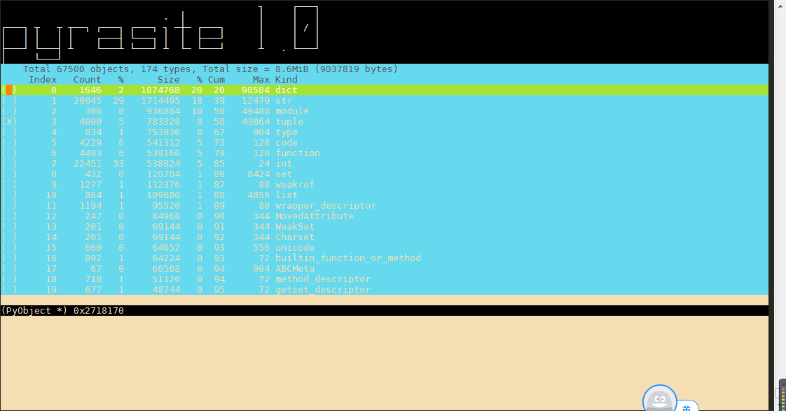

# python 下好用的注入工具 pyrasite

对于日常来说, `pycharm` 提供的单步 debug 工具和 python 自带的 logging 模块足以满足大部分的调试需求. 但在实际中遇到了这些问题:

1. 运行需要特定环境, 公司测试机无法连外网, 只有 centos 自带的 pure python 和 vim.
2. logging 模块无法输出想要的所有信息, 特别是面对内存泄漏这类棘手的问题.
3. 不希望改动代码, 尽量即插即用.
4. 程序 bug 难以复现,

找了一下, 发现了一个好用的工具 : pyrasite.

其中提供了两个工具:

1. pyrasite-shell 一个在 CLI 实现 python REPL 的注入工具. 通过其可以实时和当前的 python 程序进行交互, 包括输出或者实时更改当前变量, 实现不重启即改变程序逻辑.

   ```python
   Pyrasite Shell 2.0

   Connected to 'python ./letter.py'

   Python 2.7.5 (default, Jul 13 2018, 13:06:57)

   [GCC 4.8.5 20150623 (Red Hat 4.8.5-28)] on linux2

   Type "help", "copyright", "credits" or "license" for more information.

   (DistantInteractiveConsole)

   >>> a = 1

   >>> a

   1
   ```

2. pyrasite-memory-viewer

   需要额外依赖: urwid, meliae (需要用系统安装 python-meliae, pip 无法正常安装)

   不多说看图

   <div align="center"></div>

   打印出了 数量-总大小-占比-类型.

   提供一个思路, python 中 normal memory leak 主要有三种情况

   1. 如果是 python 的基本类型, 有可能是被全局或者生命周期比较长的对象引用了. 另外, 如果是 str 占用比较多, 则可以考虑用 `.format` 或者 `%` 来替代 `+` 进行拼接.
   2. 如果是自定类, 则看是不是改了 `__del__` 方法. 若是重写了该方法, python 不会自动回收该类型.
   3. 还有另外一种情况是互相引用导致无法回收. 这一块就要仔细检查程序的逻辑了.

彩蛋:

在用 `pyrasite-shell` 注入运行时出现了以下问题:

当运行程序过久(超过 5 秒) 而没有返回的时候,会报出以下错误, 直接退出, timeout 还没有 argv 可以设:

```python
Traceback (most recent call last):
  File "/usr/bin/pyrasite-shell", line 9, in <module>
    load_entry_point('pyrasite==2.0', 'console_scripts', 'pyrasite-shell')()
  File "/usr/lib/python2.7/site-packages/pyrasite/tools/shell.py", line 61, in shell
    payload = ipc.recv()
  File "/usr/lib/python2.7/site-packages/pyrasite/ipc.py", line 174, in recv
    header_data = self.recv_bytes(4)
  File "/usr/lib/python2.7/site-packages/pyrasite/ipc.py", line 187, in recv_bytes
    chunk = self.sock.recv(n - len(data))
socket.timeout: timed out
```

讲讲奇妙的踩坑之旅...

1. 在[官方文档](https://pyrasite.readthedocs.io/en/latest/Shell.html)下找到了这么个东西:

   ```python
       ipc = pyrasite.PyrasiteIPC(pid, 'ReversePythonShell',
                                  timeout=os.getenv('PYRASITE_IPC_TIMEOUT') or 5)
   ```

   然后按正常思维 bash 下 set 了这么一个变量: 没效果.

   然后直接梭哈改源码, 发现这个类就完全没有 timeout 这个 attr 了, 更别说怎么改.

2. 在 github repo 下找到了这么个 [issue](https://github.com/lmacken/pyrasite/issues/55), 看说已经解决了 还提了 pr, 点进去一看:

   没过 test, 无法 merge. 手动吐血.

3. 没办法, 老老实实的看源码吧.

   最后解决办法 (适用于 2.0.0):

   改源码: 在 `ipc.py`下, 第 200 行, sudo 条件下修改`self.sock.settimeout()` 问题解决.

   路径:`你的python路径/site-packages/pyrasite/ipc.py`

   要没权限, 就 fork 后改源码编译吧.
