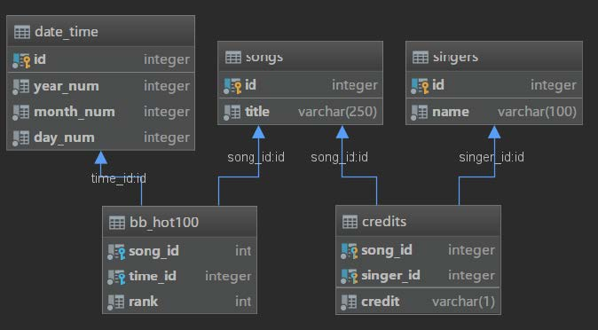

[TOC]

### 缘起
最近忙着其他事情，反倒荒废了博客。正好开始准备毕业设计了，写一个项目练练手。
之前一直在关注[美国公告榜 Billboard](http://www.billboard.com) ，虽然有官方页面和榜单搜索，但一旦面临特性化查询便显得捉襟见肘，一个基于榜单的可定义的查询从这个角度来看，还是挺有意义的。毕设想要完成的也是类似的方向，先当下哨前兵探下路。
目前的一个模糊想法是通过网页端提交查询个性化请求，在后端将其转为对应的查询 SQL 语句后可视化的返回结果。

### 设计
- [ ] 前端： 待完成，考虑使用 `React` 完成页面搭建， 通过复选框和自定义语句进行查询， 满足个性化需求
- [x] 爬虫： 初步完成，使用 `scrapy` 爬取了官方页面从 1958 年至今(2018.12.11) 3153 周的记录
- [x] 数据库： 初步完成。目前为了方便开发， 使用的还是最简单的 `SQLite` ， 后期考虑转至 `pgSQL` 
- [ ] 可视化： 待完成，考虑使用百度的开源项目 `ECharts` 

### 爬虫
#### 1. 采集
这是第一次在项目中接触爬虫，在之前只在学习 Go 语言的时候联系过一点。考虑到 Billboard 官网爬取简单，页面较少，使用了上手较轻松的 `scrapy` 。 榜单有个特点，爬取的元素虽杂，但是重复属性较多，基于此考虑使用框架提供的 **css 拾取器** ，方便采集。
信息采集完成后以 `dict` 形式存在， 之后需要对歌手这一项进行修改，才转成 `json` 格式存放在对应文件中。

#### 1. 清洗
修改说白了也很简单，因为在音乐界有这么一个 **feat.** 的现象， 很多单曲的艺人这一栏都会出现类似于 **A & B feat. C & D** 的数据。 考虑到这个项目最后是为高级化查询服务， 这个歌手的分割重要性不言自明。同时，不知是不是官网制作人故意扰乱， 艺人和艺人之间的连接词千奇百怪，五花八门，就连 feat 这么一个都有四种写法，更别说正常连接词了。举几个例子。

```markdown
Marshmello **&** Bastille 两位歌手，连接词为`&`

Gucci Mane **X** Bruno Mars **X** Kodak Black 三位歌手，连接词为`X`

XXXTENTACION **x** Lil Pump **Featuring** Maluma **&** Swae Lee 两位歌手，连接词为`x`，两位合作者，连接词为`&`
```

如果单是连接词的问题，那还好处理，分成歌手和合作者之后，再用正则暴力切割即可。一敲代码，新问题又出现了：

```markdown
**Years & Years** 歌手本身名字中含有连接词？（英国组合年年）

Justin Bieber **Duet With** Mariah Carey 两位歌手，二重唱类型合作？

Walter Brennan With Billy Vaughn and **his Orchestra** XXX 和他的管弦乐队？这怎么分？

7. Ludacris Featuring **Pharrell** 歌手有别名？ Pharrell 就是 菲董，Pharrell Williams

**jay-z** 大小写问题？碧昂斯的丈夫，还会出现 Jay-z，JAY-Z，真禁忌·三重镜像

jay-z & **b** 这个 b ??? 就是 Beyonce
```

像这种涉及到语义和语境的问题，就很棘手了。目前通过一些明显的特征解决了一部分（艺人名称只有一个单词或者超过五个单词，或者连接词过多），但毕竟不是长久之策。现在的一个思路是通过网上的音乐数据库进行查询，进行数据的清洗，会在下一阶段完善。

最终一周的榜单使用 json 格式存储如下：
```json
{"time": "December 8, 2018",
  "records": [
    {"rank": 1, "title": "Sicko Mode", "singers": ["Travis Scott"], "featuring": null},
    {"rank": 2, "title": "Thank U, Next", "singers": ["Ariana Grande"], "featuring": null},
    {"rank": 3, "title": "Happier", "singers": ["Marshmello", "Bastille"],"featuring": null}
    ...
    {"rank": 100, "title": "Close To Me", "singers": ["Diplo"], "featuring": ["Swae Lee"]}
  ]
}
```
当一页爬取完成后，需要获取下一页的链接继续工作。这里同样使用 **css 拾取器** 搭配 **xpath** 使用，获取后交给引擎存入调度器即可。当无法获取时，结束爬取。
官网爬取页面实在简单，不需要登陆(存 cookies )，没有验证码，不会封 IP， 没有 ajax，不需要无头浏览器，页面元素一，页面数量少( 3k )，用来入门太适合不过了。

待完成：
- [ ] 通过网上的音乐数据库进行查询，数据清洗
- [ ] 补齐艺人的个人信息，包括性别，生日，别名，国籍等
- [ ] 补全歌曲的信息
- [ ] 爬取 Billboard 其他榜单， 如年榜，TOP 200
- [ ] 补全专辑模块
- [ ] 完善 workflow

### 数据库
#### 1. 设计

在一开始时，想着尝鲜试下新型的时间序列型数据库 influxdb ，参见知乎的文章 [时间序列数据库漫谈](https://zhuanlan.zhihu.com/p/29367404)：
> 存储在服务端的客户端历史。 时间序列数据就是历史，它具有不变性, 唯一性以及可排序性。
对于榜单这一类型的数据，是极为适合的。考虑这三个特性：
1. 不变性：数据几乎不会发生变化，一旦产生了就不会再更新。
2. 唯一性：对于任一时刻，任一榜单，任一位置，只会存在唯一一个值。
3. 可排序性：时刻可排序，位置可排序。
但最终纠结之后，还是使用了传统的关系型数据库：
1. 不兼容 SQL 语句， 需要额外学习 Powerful Query Language (类 SQL 语句)
2. Python 没有比较成熟的库，需要使用 HTTP API 进行联接
3. 毕业设计使用的是 RDBMS 和 NoSQL ， 在选型上尽量保持一致。(先提取出一份 json 文件也基于此考虑)

#### 2. ER 关系图
<div align="center"></div>

通过 `PyCharm` 自带工具导出的 ER 关系图。表 `date_time` 主要是考虑到官网给出的是具体的年月日，但在查询中可能会更关注周次，在后期会在其中再新增一列专门用来存放周次。

#### 2. 补遗
- [ ] 修改 date_time , singers ，补全相关信息
- [ ] 每爬取多一份榜单，需要增加多一张表，需要有一个表来储存所有榜单的信息
- [ ] 补全专辑模块
- [ ] 更改数据库类型为 MySQL 或者 PgSQL

PS ： 第二弹已经发出，详见 基于 Billboard 榜单的个性化查询服务（二）