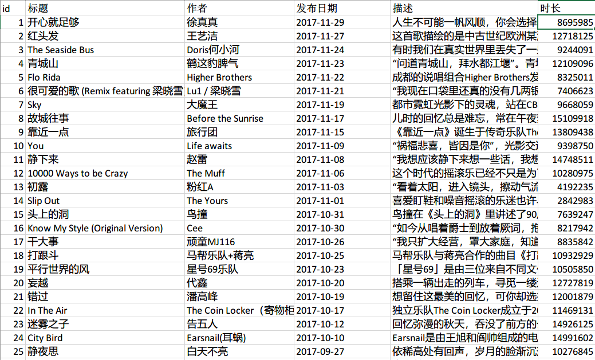
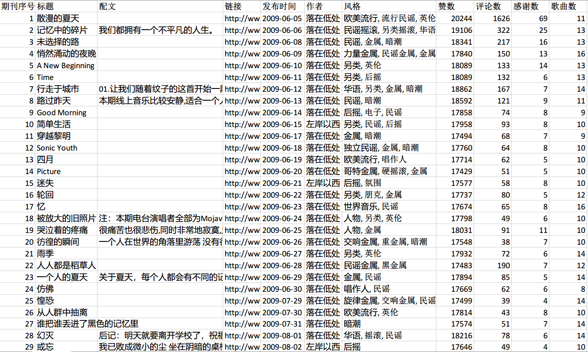
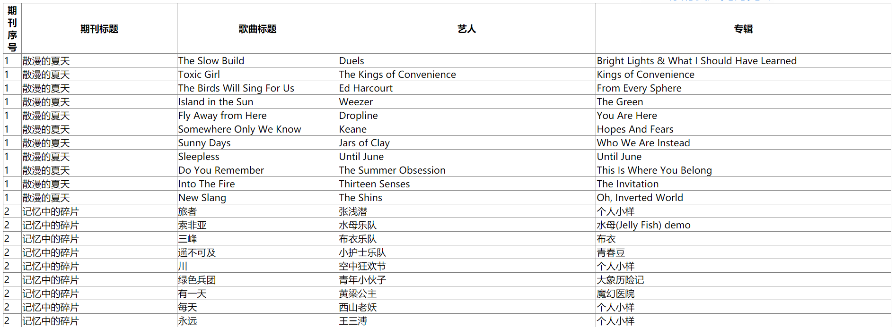
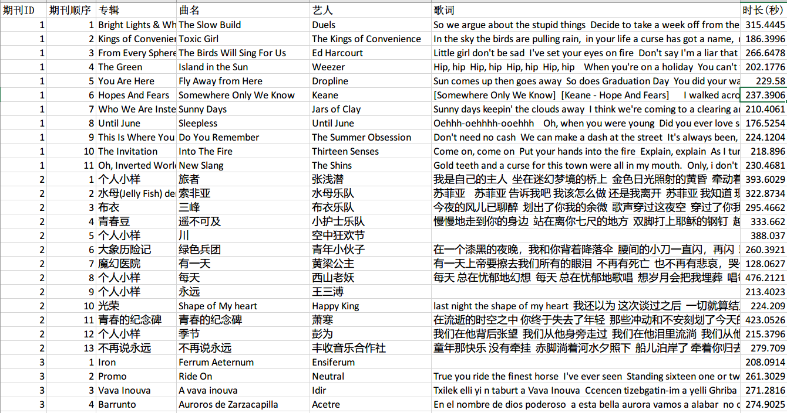
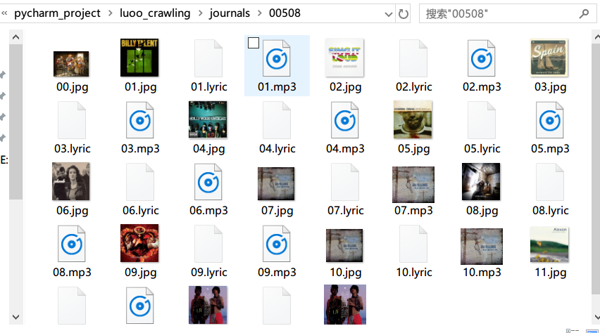

[TOC]

## 落网单曲推荐专栏

2018-12-25 新增

1.专栏信息

百度云链接：[https://pan.baidu.com/s/1s8fMAgaQx4uAivAxUauqjg](https://pan.baidu.com/s/1s8fMAgaQx4uAivAxUauqjg#fyy7) 提取码：fyy7 

2.单曲下载
共有 **569** 首单曲，每首单曲有 mp3 文件和配图。

百度云链接：[https://pan.baidu.com/s/10Qf692epbfWZA3aHcGJqCw](https://pan.baidu.com/s/10Qf692epbfWZA3aHcGJqCw#h9qb) 
提取码：h9qb 

## **期刊的信息**

PS： 2018.20.20 新增风格一列

百度云链接：链接: [https://pan.baidu.com/s/11qwiXfuyudZpYjXwS55T9A](https://pan.baidu.com/s/11qwiXfuyudZpYjXwS55T9A#kjtr) 提取码: kjtr 

石墨在线文档链接：[https://shimo.im/sheet/4PA9lOtAwjUqcKkx/](https://shimo.im/sheet/4PA9lOtAwjUqcKkx/) 

## **查找用**

百度云链接：[https://pan.baidu.com/s/1nVbv06_zgS5QnqpDIhbo9Q](https://pan.baidu.com/s/1nVbv06_zgS5QnqpDIhbo9Q#7hpt#7hpt)  提取码：7hpt 

## **单曲的信息**

链接：[https://pan.baidu.com/s/18KSihs6WUYcitgbbMCQVKw](https://pan.baidu.com/s/18KSihs6WUYcitgbbMCQVKw#cdej)  提取码：cdej 

石墨在线文档链接：[https://shimo.im/sheet/m2bGvxUMW6wN6VB0/](https://shimo.im/sheet/m2bGvxUMW6wN6VB0/)

------

## **期刊内容 下载链接**

PS ： 总计有 **1000**期期刊：

1. 常规期刊 **1-993** 共 **989** 期 ，这里缺了 4 期是：544，566，567，568 ，本身落网上就缺少，不是爬取的问题，算是一个小彩蛋吧
2. 付费期刊的试听部分 **10001-10022** 共 **11** 期

001-100期：链接：[https://pan.baidu.com/s/1VH6QPMpdPQxDHifCiYP9pA](https://pan.baidu.com/s/1VH6QPMpdPQxDHifCiYP9pA#qxle)  提取码：qxle 

101-200期：链接：[https://pan.baidu.com/s/1cUDJs-j-CGc5OCf3fvBSFQ](https://pan.baidu.com/s/1cUDJs-j-CGc5OCf3fvBSFQ#h3co)  提取码：h3co 

201-300期：链接：[https://pan.baidu.com/s/1mbw3wBXvhFz8fhGApfRY8A](https://pan.baidu.com/s/1mbw3wBXvhFz8fhGApfRY8A#eiyn)  提取码：eiyn 

301-400期：链接：[https://pan.baidu.com/s/1rnH4rzOrFV6dPE70WbM1Ag](https://pan.baidu.com/s/1rnH4rzOrFV6dPE70WbM1Ag#ywj6)   提取码：ywj6 

401-500期：链接：[https://pan.baidu.com/s/1d8wOttJ395FpvNrYIiB_Yg](https://pan.baidu.com/s/1d8wOttJ395FpvNrYIiB_Yg#fm30)   提取码：fm30

501-600期：链接：[https://pan.baidu.com/s/1w-MzwBEskrjbIaInVAEkFw](https://pan.baidu.com/s/1w-MzwBEskrjbIaInVAEkFw#1wnv)  提取码：1wnv 

601-700期：链接：[https://pan.baidu.com/s/1W5oMDoK6jycBeOhUupHASA](https://pan.baidu.com/s/1W5oMDoK6jycBeOhUupHASA#8bkg)  提取码：8bkg 

701-800期：链接：[https://pan.baidu.com/s/1xNMBzHroiXnCf6-jDiIY1Q](https://pan.baidu.com/s/1xNMBzHroiXnCf6-jDiIY1Q#azp7)   提取码：azp7 

801-900期：链接：[https://pan.baidu.com/s/1sXsGi4DrDQABwCP54PB-RQ](https://pan.baidu.com/s/1sXsGi4DrDQABwCP54PB-RQ#cr4d)  提取码：cr4d 

0901-10022期： 链接：[https://pan.baidu.com/s/1U4i_kVhi0ZPn7lnN3jdLfA](https://pan.baidu.com/s/1U4i_kVhi0ZPn7lnN3jdLfA#x2zs)  提取码：x2zs 

## 至此已全部上传完成

每一期都是这么组成的， 00.jpg 是期刊的配图，一支单曲有歌词，mp3 文件和专辑封面

